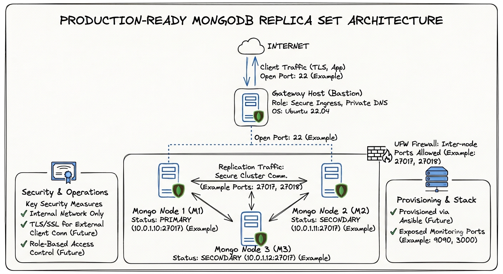
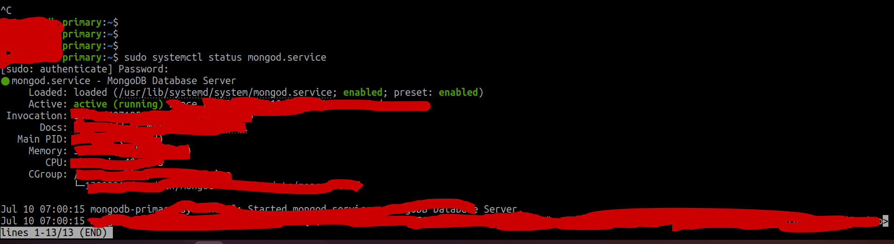

# Production-Ready-MongoDB-Replica-Set-Deployment-for-High-Availability

### This project demonstrates how to deploy a production-ready MongoDB Replica Set across three private Linux servers connected through a gateway server.
### The deployment focuses on High Availability, Authentication, Security, and Operational Best Practices.
---

## 🚨 The Challenge (Why this was needed)
Deploying a single database instance on production poses critical risks:
* **Single Point of Failure (SPOF):** If the database server goes down, the entire application goes offline.
* **Security Exposure:** Keeping database instances directly accessible from the internet invites brute-force attacks and security breaches.
* **Data Loss Risk:** No built-in automated replication or failover mechanism to keep data safe during hardware failure.

---

## 💡 The Solution (High-Level Architecture)

To solve these production challenges, we implemented a decoupled, secure, and resilient infrastructure:

1. **Network Isolation:** All MongoDB nodes are hosted inside a private network, strictly inaccessible from the internet.
2. **Access Control:** System administrators can only access the database nodes via SSH tunneling through a hardened public Gateway (Bastion) host.
3. **High Availability:** Configured a 3-Node MongoDB Replica Set to guarantee auto-failover and zero data loss.

## 🚀 Features

* **✔ 3 MongoDB Nodes:** A robust multi-node architecture to prevent single points of failure.
* **✔ Replica Set:** Configured for seamless data redundancy and high availability.
* **✔ Automatic Failover:** Tested and verified instant election of a new primary node.
* **✔ Private Network:** Isolated database tier with zero direct public internet exposure.
* **✔ Keyfile Authentication:** Secure internal cluster membership validation.
* **✔ Internal Communication:** Inter-node traffic fully secured and authenticated.
* **✔ Gateway Server:** Bastion host setup for secure external administrative access.
* **✔ Firewall Configuration:** Strict port filtering to block unauthorized entry points.
* **✔ Backup Strategy:** Automated scheduling and execution of logical database backups.
* **✔ Monitoring Ready:** Outlined integration for comprehensive database health metrics.

---

## 📐 Architecture

The database cluster is isolated inside a secure private network. All administrative access is strictly tunneled through a public-facing Gateway (Bastion) host.
```text
                       Internet
                          │
                   +--------------+
                   | Gateway Host | (Public IP - SSH Only)
                   +--------------+
                          │
       ┌──────────────────┼──────────────────┐
       │ (Private Net)    │ (Private Net)    │ (Private Net)
+-------------+    +-------------+    +-------------+
| Mongo Node1 |    | Mongo Node2 |    | Mongo Node3 |
|  Primary    |    |  Secondary  |    |  Secondary  |
+-------------+    +-------------+    +-------------+
```

## 🛠️ Technologies & Tools Used
* OS: Ubuntu 22.04 LTS (On all 4 servers)
* Database: MongoDB Community Edition (v0.0)
* High Availability: MongoDB Replica Set Engine
* Security: OpenSSL (Keyfile generation), SSH (Secure Tunneling)
* Networking: Private Subnets & Host Resolution
* Process Management: systemd
* Scripting: Bash (Automation & Backups)
* Firewall: UFW (Uncomplicated Firewall)
---

## 🛠️ How It Was Implemented (Reference-Based)
### Instead of manual configurations, the deployment was strictly structured according to enterprise production standards and MongoDB official guidelines. For security and compliance, all external references are kept modular:

* Server Provisioning & Hostname Resolution: Hardened 3 Ubuntu VMs and resolved hosts locally (e.g., mongo-node1, mongo-node2, mongo-node3) to allow secure inter-node communication.

* Database Deployment: Installed MongoDB Community Edition by strictly following the official OS installation steps. [https://www.mongodb.com/docs/v7.0/]

* Replica Set Architecture & High Availability: Designed the cluster topology with dedicated Primary and Secondary members, optimizing Elections (using election protocols, priority settings, and heartbeat settings) and monitoring the Oplog size and replication lag for data synchronization. Detailed design was aligned with MongoDB Replication core concepts. [https://www.mongodb.com/docs/v7.0/replication/]

* Production Hardening & Self-Managed OS Tuning: Optimized the underlying infrastructure for self-managed instances. Formatted data drives, modified kernel parameters, disabled THP, and set file descriptors (ulimit) to prevent bottlenecks under production loads. Configured in alignment with official Production Notes. [https://www.mongodb.com/docs/atlas/production-notes/]

* Network & Configuration Hardening: Secured the self-managed deployment by restricting inbound traffic to port 27017 using host-level firewalls (UFW), binding MongoDB to secure private network interfaces only, and preventing unauthorized external access. Built according to Self-Managed Network Hardening practices. [https://www.mongodb.com/docs/atlas/production-notes/]

* Global Access Control & User Security: Implemented Role-Based Access Control (RBAC) and enabled global database authorization (SCRAM-SHA-256) to ensure that only authenticated clients can read or write to the cluster. Guided by the official Security Checklist. [https://www.mongodb.com/docs/v7.0/administration/analyzing-mongodb-performance/]

---

## 🔍 Verification & Screenshots

> 💡 *Below are the real-time verifications from the running environment.*

### 1. Verification of MongoDB Services
Checking that the database service is up, hardened, and active on the nodes:


### 2. Cluster Status & Membership
Running `rs.status()` on the primary node to verify all three nodes joined successfully:


### 3. Automatic Failover Test
Simulating primary node failure (`systemctl stop mongod`) and verifying the seamless automatic election of a new Primary node within seconds:


### 4. Database Security Proof
Verifying that database reads/writes are strictly unauthorized without active credentials:
``

---

## ⚠️ Troubleshooting (Real-World Issues Faced & Solved)

During the deployment of this production environment, several real-world challenges were encountered and successfully resolved:

### 1. Node Recovery Stuck in `STARTUP2` State
* **The Problem:** One of the secondary nodes remained stuck in `STARTUP2` and refused to transition to `SECONDARY` status.
* **The Cause:** A huge initial sync payload coupled with temporary network latency between the private subnets.
* **The Solution:** Adjusted the `heartbeatTimeoutSecs` parameter, cleared the partial data directory on the stuck node, and allowed the initial sync to restart cleanly.

### 2. Primary Election Failure During Failover
* **The Problem:** When the primary node was shut down, the remaining two nodes failed to elect a new Primary, leaving the cluster in read-only mode.
* **The Cause:** Strict firewall rules (`UFW`) were blocking the port `27017` communication between the two secondary nodes themselves (they could only talk to the old primary).
* **The Solution:** Updated the `UFW` rules on all nodes to explicitly allow bidirectional communication across all member private IPs, not just to/from the primary.

### 3. Authentication Failures During Inter-Node Sync
* **The Problem:** After enabling authentication (`security.authorization: enabled`), the secondary nodes were blocked from syncing data from the primary.
* **The Cause:** MongoDB requires an internal clustering authentication mechanism once client authorization is active.
* **The Solution:** Referenced the [MongoDB Internal Authentication Docs](https://www.mongodb.com/docs/manual/core/security-internal-authentication/) to generate and configure a secure shared Keyfile for cluster-member-only communication.

### 4. Client Connection Timeout from Gateway
* **The Problem:** Testing database access from the Gateway host resulted in connection timeouts.
* **The Cause:** The MongoDB configuration file (`/etc/mongod.conf`) was only binding to `127.0.0.1` (localhost).
* **The Solution:** Edited the configuration to bind to both localhost and the node's private IP address: `bindIp: 127.0.0.1,<node_private_ip>`.
